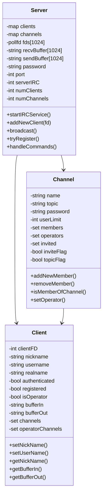
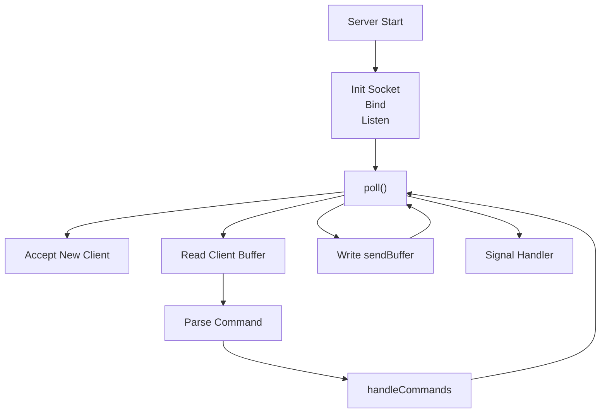
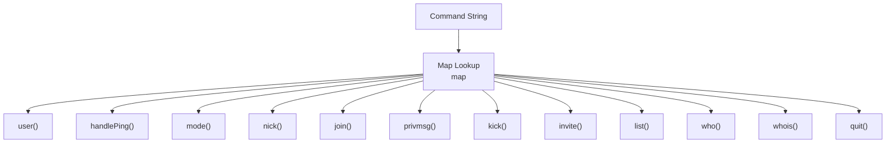
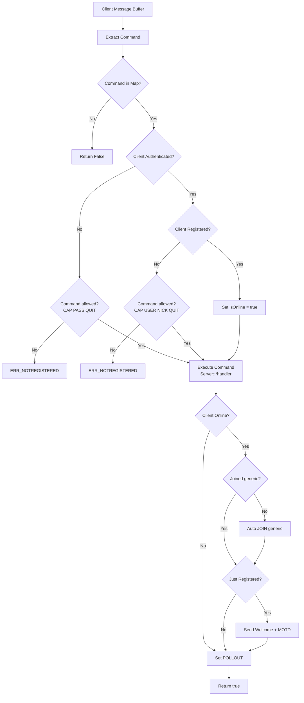
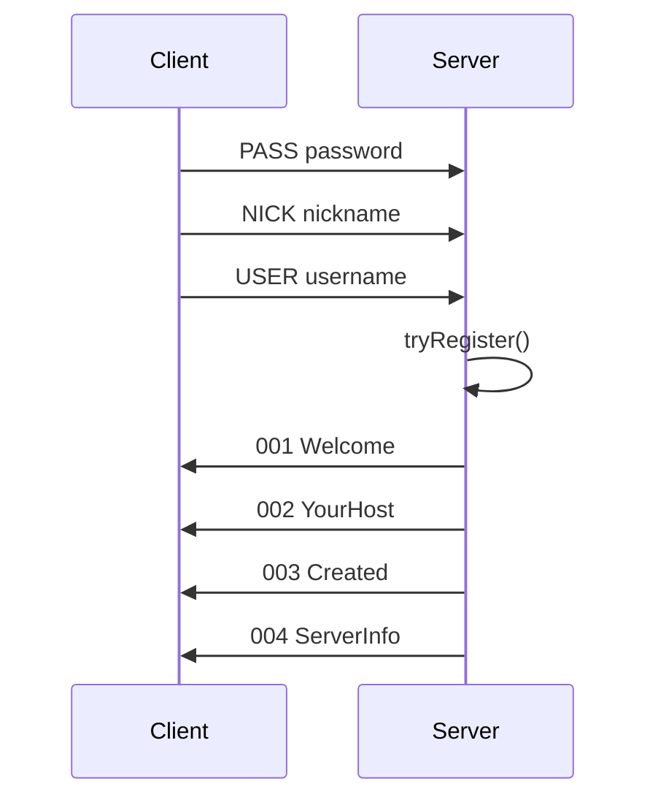

  

IRC Server, the "ancient Discord".

<h1 align="center">
  
   
  ft_irc
   
</h1>

<h4 align="center">
  A minimal IRC server implementation in <a href="https://isocpp.org/" target="_blank">C++</a> compatible with standard IRC clients such as <code>Irssi</code>.
</h4>

  
  
  
  

# About the Project

The server implements the core parts of the IRC protocol and supports multiple clients, channels, and operator privileges using a non-blocking polling architecture.

## Features
- Non-blocking TCP server
- Poll-based event loop
- Multi-client support
- Channel management
- Channel and User modes

## Architecture
The server is centered by `Server` class.

### Class architecture

### Poll Event Loop

### Command Dispatch System

### Map

### Command flow

### Client Registration Flow

### Responsabilities
- Manage socket connections
- Parse IRC commands
- Maintain client state
- Maintain channel state
- Broadcast messages
- Handle auth and registration

## How to connect

### Run server
- Run `make` to compile
- `./ircserv <port> <pass>`
- Example `./ircserv 6667 12345`

### Connect
- Open `irssi`
- Run `/connect 127.0.0.1 <port> <password>`

